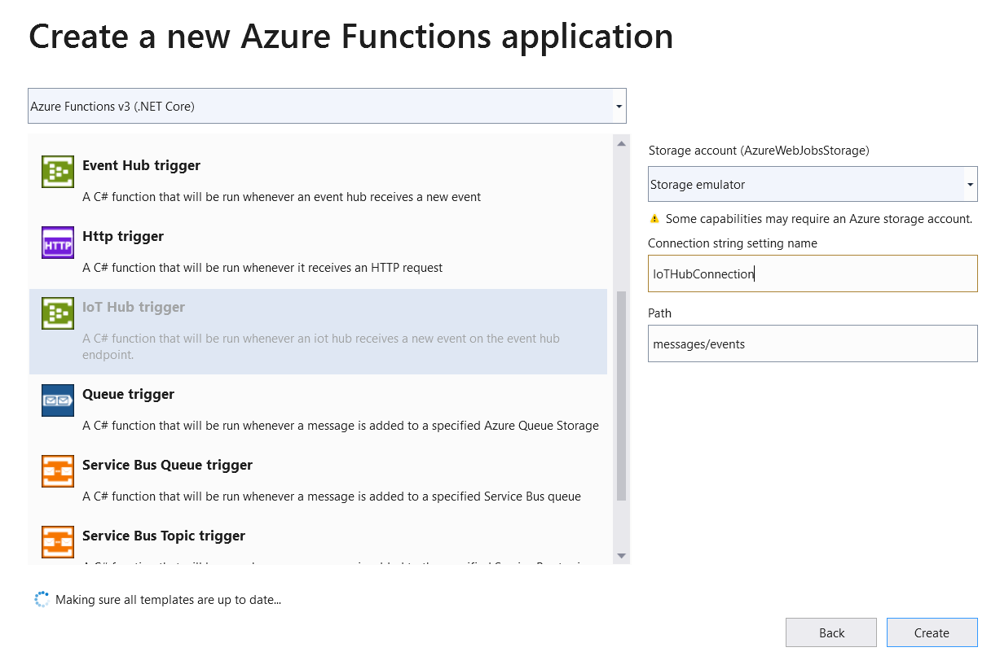
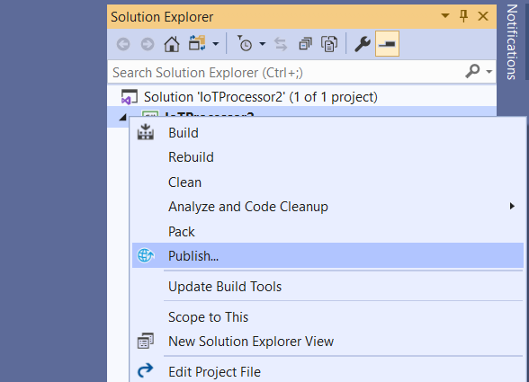

# IoT Event to SQL Server

**Produced by Dave Lusty**

## Introduction

This is a demo showing you how to use an Azure Function App to process incoming messages from IoT Hub and pass them to a SQL Server for further processing. This is useful in situations where your IoT devices might be sending in a JSON array rather than individual values. We can then use a Function App to separate these for individual processing. In this demo we will move them on to an Event Hub where other functions and apps can process them.

## SQL Database

<table>
<tr>
<td width="60%">The sink for this function is a SQL Database so we first need to create that. In the portal, create a new SQL Database.</td>
<td width="40%"></td>
</tr>
<tr>
<td width="60%">Click to create a new server, give it a name and choose the same region as your other components.</td>
<td width="40%"></td>
</tr>
<tr>
<td width="60%">Select the smallest basic configuration for this demo to keep costs down.</td>
<td width="40%"></td>
</tr>
<tr>
<td width="60%">give the database a name and click create. Use the same resource group as other components.</td>
<td width="40%"></td>
</tr>
<tr>
<td width="60%">Once the database is created open the firewall settings and add your local IP so that you can use Query Editor. Also tick the box to allow other Azure services in your subscription access so that the function app has permissions.</td>
<td width="40%"></td>
</tr>
<tr>
<td width="60%">Now open query editor to create the table for the function app to write data into.</td>
<td width="40%"></td>
</tr>
</table>

This query creates a very simple table with one column which will contain the JSON from the message.

```SQL
CREATE TABLE BeaconRecords ( (
    jsontext text
); 
```

## Code

### Create the Function App project

<table>
<tr>
<td width="60%">Open Visual Studio and select Create New Project.</td>
<td width="40%"></td>
</tr>
<tr>
<td width="60%">Search for and select a new Azure Functions project using C#.</td>
<td width="40%"></td>
</tr>
<tr>
<td width="60%">Give your project a name and location and click create.</td>
<td width="40%"></td>
</tr>
<tr>
<td width="60%">Select IoT Hub as the trigger. We'll use the storage emulator for local testing, and give the app setting a name of IoTHubConnection.</td>
<td width="40%"></td>
</tr>
</table>

### local.settings.json

In your project, open the local.settings.json file and add in values for the IoTHubConnection and SQLDBConnection. Also fill in the AzureWebJobStorage with your storage account connection string which is used by the function app.
```JSON
{
    "IsEncrypted": false,
  "Values": {
    "AzureWebJobsStorage": "Storage account connection string here",
    "FUNCTIONS_WORKER_RUNTIME": "dotnet",
    "IoTHubConnection": "IoT Hub Connection String Here",
    "sqldbConnection": "SQL Server Connection String Here"
  }
}
```

Once you compile and upload your function you will need to add these settings to the Function App service in the portal.

### Function Code

At the top of the file we add in the various modules we need. This will include System.Threading.Tasks to allow us to process multiple events asynchronously, as well as Newtonsoft.Json.Linq to allow us to easily process the JSON data. You may also need to install the modules using NuGet.

```CSHARP
using IoTHubTrigger = Microsoft.Azure.WebJobs.EventHubTriggerAttribute;

using Microsoft.Azure.WebJobs;
using Microsoft.Azure.WebJobs.Host;
using Microsoft.Azure.EventHubs;
using System.Text;
using System.Net.Http;
using Microsoft.Extensions.Logging;
using System.Data.SqlClient;
using System.Threading.Tasks;
using Microsoft.Extensions.Configuration;
using Newtonsoft.Json.Linq;
```

Next is the actual function itself. You can include multiple functions in one code file if you wish, I kept them separate for simplicity in a demo.

```CSHARP

namespace IoTProcessor2
{
    public static class Function1
    {
        private static HttpClient client = new HttpClient();

```

Here we have puplic static async Task, indicating that this will spawn multiple tasks, you'll need to change this since the default is a standard function which returns one value and exits. Since we have one array coming in and then multiple messages going out we need to branch the code out. Each task will write a single element from the incoming array to the SQL Server output. We're using tasks here to avoid latency on each event being processed, otherwise the function would need to wait for a response before processing the next element.
You can see the trigger in this line with the IoT Hub connection. I also added a Consumer Group (under "built in endpoints on the IoT Hub interface) for this function app. This consumer group ensures that this function has its own pointer within the data in the hub. If you create a second function, use a second consumer group to ensure both get all of the data. To scale you could also have two functions in the same consumer group, with each processing some of the data. 
Finally I added the execution context to allow us access to app settings such as the SQL connection string.
Note that since SQL Server is not a standard sink for Event Hubs that we do not have an output module in this function. Instead we use CSharp code to connect to the database and write out the data.
In all of these demos we write the incoming data out to a log so you can see what's happening. This is useful for troubleshooting but not necessary in a production envoironment.

```CSHARP

        [FunctionName("Function1")]
        public static async Task Run([IoTHubTrigger("messages/events", Connection = "IoTHubConnection", ConsumerGroup = "sqlfunction")]EventData message, ILogger log, ExecutionContext context)
        {
            log.LogInformation($"C# IoT Hub trigger function processed a message: {Encoding.UTF8.GetString(message.Body.Array)}");
```

Next we use some code to recall the app setting for SQL connection string. This is held by the Function App service for security reasons, and we recall it here to use for connecting to the database since we're not using an output module. This code snippet can be used to retrieve any variable you wish, just replace sqldbConnection in the last line with your setting name.

```CSHARP
            //get the SQL account info from application settings
            var config = new ConfigurationBuilder()
                .SetBasePath(context.FunctionAppDirectory)
                .AddJsonFile("local.settings.json", optional: true, reloadOnChange: true)
                .AddEnvironmentVariables()
                .Build();
            var sqlString = config["sqldbConnection"];
```

The first thing we do in the function is parse the JSON to an array so that we can process each element within it as a single message. Here we use the NewtonSoft JArray.Parse on the body of the message.

```CSHARP
            //split out the incoming JSON into an array
            JArray beaconRecords = JArray.Parse(Encoding.UTF8.GetString(message.Body.Array));
```
Finally we iterate through the array and insert the JSON into the database. Here I simply push the whole message into a field, but we could easily break out the data further and insert individual values.

```CSHARP
            using (SqlConnection conn = new SqlConnection(sqlString))
            {
                conn.Open();

                //Iterate through the array and submit to the eventhub
                foreach (var beaconRecord in beaconRecords.Children())
                {
                    var text = "INSERT INTO BeaconRecords (jsontext) VALUES ('" + beaconRecord.ToString() + "');";

                    using (SqlCommand cmd = new SqlCommand(text, conn))
                    {
                        // Execute the command and log the # rows affected.
                        var rows = await cmd.ExecuteNonQueryAsync();
                        log.LogInformation($"{rows} rows were updated");
                        //log the message being submitted, comment this out to improve performance
                        log.LogInformation("Added: " + beaconRecord);
                    }
                }
            }
        }
    }
}
```

<table>
<tr>
<td width="60%">Click to run the app locally and you will see data being processed in the log. First you'll see the incoming array and then each outgoing message. This will continue until all incoming data is processed. You can use Query editor in the portal to see these messages in SQL Server.</td>
<td width="40%"></td>
</tr>
</table>

### Publish

<table>
<tr>
<td width="60%">Once you're ready to publish right click on the project and select publish.</td>
<td width="40%"></td>
</tr>
<tr>
<td width="60%">Select Azure as the target.</td>
<td width="40%"></td>
</tr>
<tr>
<td width="60%">Select Function App Windows target.</td>
<td width="40%"></td>
</tr>
<tr>
<td width="60%">You may need to log in, then select your Function App in your subscription. Click Finish to complete the task.</td>
<td width="40%"></td>
</tr>
<tr>
<td width="60%">Click Deploy to push your code to Azure. You can later make changes and click this button to redeploy without needing to go through the whole wizard again.</td>
<td width="40%"></td>
</tr>
<tr>
<td width="60%">In the portal, add the keys to match your local.settings.json file. Your app will then start to run and process data.</td>
<td width="40%"></td>
</tr>
</table>