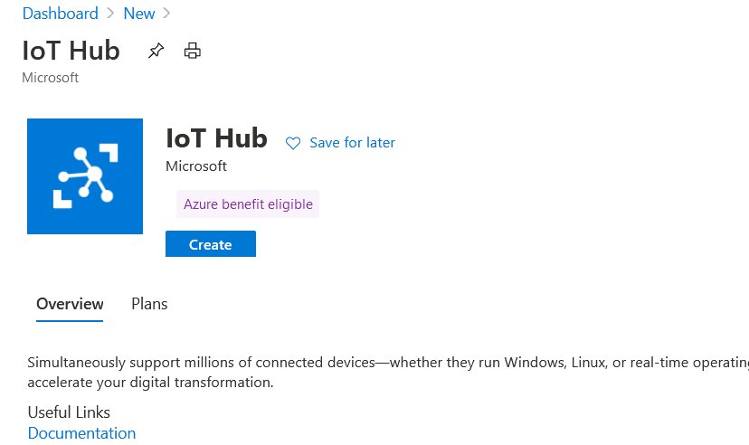
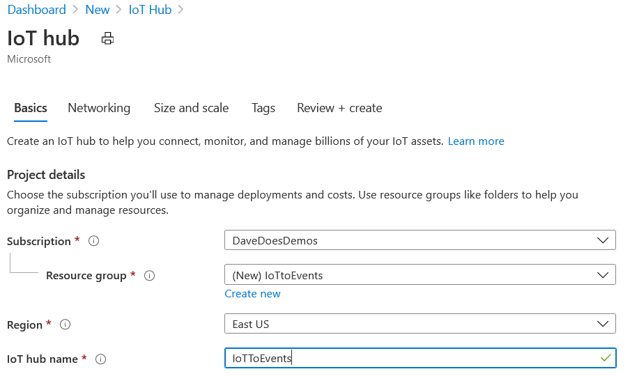
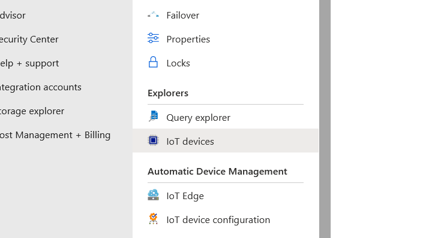
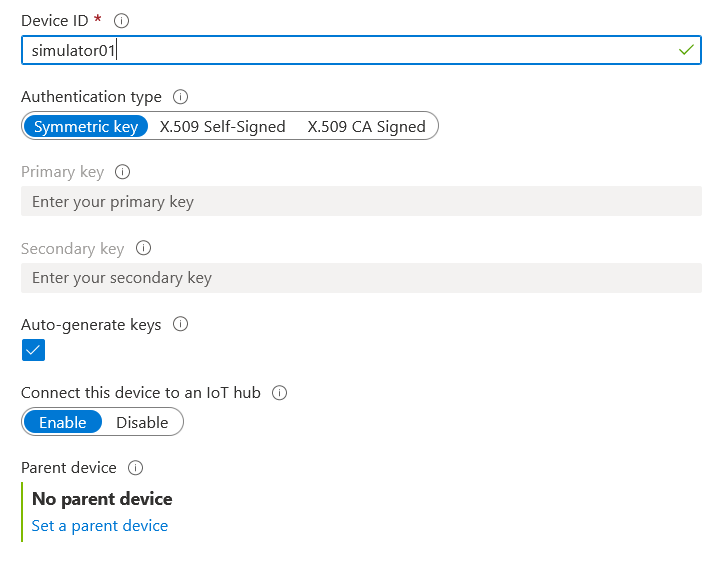
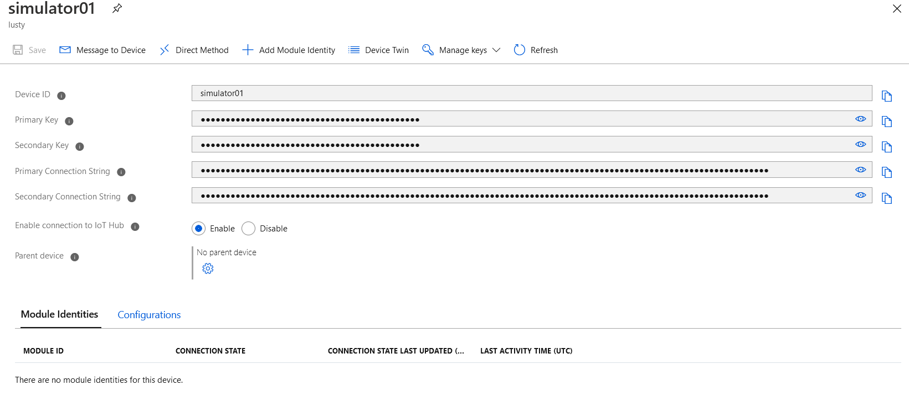
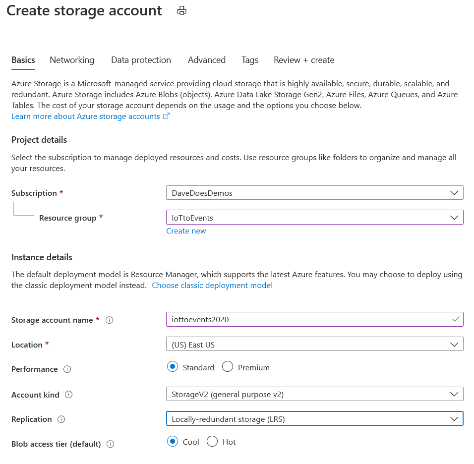
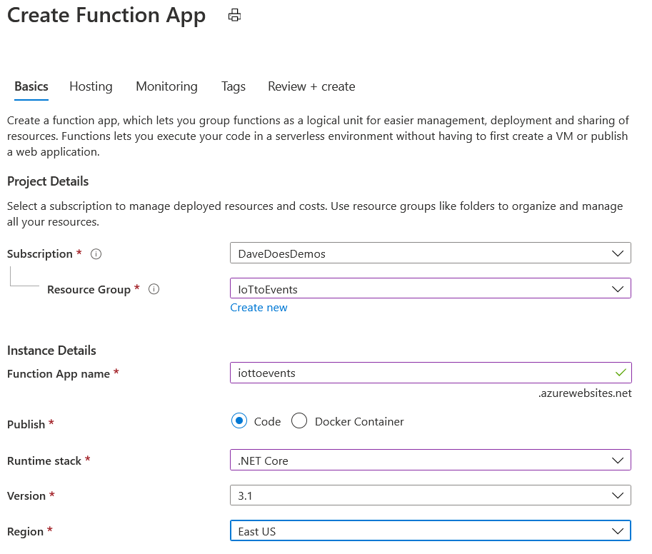
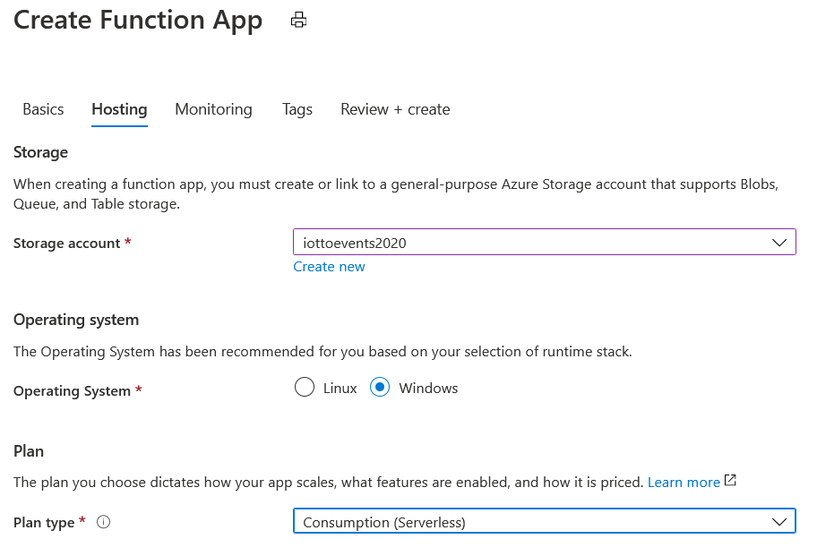

# IoT Event Processor

**Produced by Dave Lusty**

## Introduction

This is a demo showing you how to use an Azure Function App to process incoming messages from IoT Hub and pass them to an Event Hub or to SQL Server for further processing. This is useful in situations where your IoT devices might be sending in a JSON array rather than individual values. We can then use a Function App to separate these for individual processing. In this demo we will move them on to an Event Hub where other functions and apps can process them.

There is a [video of this demo not ready yet](https://youtube.com/davedoesdemos)

## Introduction

There are several pieces involved in writing a function app using triggers, inputs and outputs. You'll need to know about the following:

* Triggers
* Input Bindings
* Output Bindings
* Async apps

In addition to this, you'll need to configure the infrastructure, publish the function, and integrate the other components with bindings and app settings.

### Triggers and bindings

A trigger will be what causes your Function to run. An Input is optional, and used to collect data if your trigger does not provide it. Outputs are where your data is sent by the function. A full list of bindings can be found at [functions-triggers-bindings](https://docs.microsoft.com/en-us/azure/azure-functions/functions-triggers-bindings) and each one links to a full page of documentation explaining how to use that binding.

#### IoT Trigger

For this project we will be using the IoT Hub trigger to process messages from an IoT Hub. Documentation for the IoT Hub trigger is available at https://docs.microsoft.com/en-us/azure/azure-functions/functions-bindings-event-iot-trigger?tabs=csharp
This trigger is the same as the Event Hubs trigger, and so code will work the same for both.

Of particular note is the ConsumerGroup property which allows us to specify a consumer group for reading the messages. This, in turn, allows us to process messages in more than one application by creating consumer groups for each. This ensures that each application has a checkpoint and processes all messages.

```csharp
  public static void Run([IoTHubTrigger("messages/events", Connection = "IoTHubConnection", ConsumerGroup = "functionapp")]EventData message, ILogger log)
        {
            log.LogInformation($"C# IoT Hub trigger function processed a message: {Encoding.UTF8.GetString(message.Body.Array)}");
        }
```

### Async Apps

Some triggers will start an app and have no data, for instance a timer. Others will start an app with one piece of data. In this scenario, the app will do something with the data and then when the app is finished, the data is returned to the output binding and the app terminates. This is also the case with HTTP responses where a single response is required. Finally, you may have a trigger which provides multiple data in an array. In this instance you cannot simply return the data and terminate the app since you need to process all of the data. Here you should configure the app as async and return the data piece by piece until you run out and only then terminate the app. Each trigger, input and output will detail the ways of using it, but you may need to look carefully to notice the async keyword.

This example [from the Event Hub documentation](https://docs.microsoft.com/en-us/azure/azure-functions/functions-bindings-event-hubs?tabs=csharp#output) shows the return method if you have one output:

```CSHARP
[FunctionName("EventHubOutput")]
[return: EventHub("outputEventHubMessage", Connection = "EventHubConnectionAppSetting")]
public static string Run([TimerTrigger("0 */5 * * * *")] TimerInfo myTimer, ILogger log)
{
    log.LogInformation($"C# Timer trigger function executed at: {DateTime.Now}");
    return $"{DateTime.Now}";
}
```

And this example [from the Event Hub documentation](https://docs.microsoft.com/en-us/azure/azure-functions/functions-bindings-event-hubs?tabs=csharp#output) shows the async method where you use an IASyncCollector object to iterate through data:

```CSHARP
[FunctionName("EH2EH")]
public static async Task Run(
    [EventHubTrigger("source", Connection = "EventHubConnectionAppSetting")] EventData[] events,
    [EventHub("dest", Connection = "EventHubConnectionAppSetting")]IAsyncCollector<string> outputEvents,
    ILogger log)
{
    foreach (EventData eventData in events)
    {
        // do some processing:
        var myProcessedEvent = DoSomething(eventData);

        // then send the message
        await outputEvents.AddAsync(JsonConvert.SerializeObject(myProcessedEvent));
    }
}
```

Note the "public static async Task" which will also need [System.Threading.Tasks](https://docs.microsoft.com/en-us/dotnet/api/system.threading.tasks?view=netframework-4.8) to be added to the code to support the methods used.

### Parsing the JSON

Using Newtonsoft JSON.net https://www.newtonsoft.com/json/help/html/QueryJsonDynamic.htm

```csharp
string json = @"[
  {
    'Title': 'Json.NET is awesome!',
    'Author': {
      'Name': 'James Newton-King',
      'Twitter': '@JamesNK',
      'Picture': '/jamesnk.png'
    },
    'Date': '2013-01-23T19:30:00',
    'BodyHtml': '&lt;h3&gt;Title!&lt;/h3&gt;\r\n&lt;p&gt;Content!&lt;/p&gt;'
  }
]";

dynamic blogPosts = JArray.Parse(json);

dynamic blogPost = blogPosts[0];

string title = blogPost.Title;

Console.WriteLine(title);
// Json.NET is awesome!

string author = blogPost.Author.Name;

Console.WriteLine(author);
// James Newton-King

DateTime postDate = blogPost.Date;

Console.WriteLine(postDate);
// 23/01/2013 7:30:00 p.m.
```

https://www.newtonsoft.com/json/help/html/SerializeObject.htm

```csharp
Account account = new Account
{
    Email = "james@example.com",
    Active = true,
    CreatedDate = new DateTime(2013, 1, 20, 0, 0, 0, DateTimeKind.Utc),
    Roles = new List<string>
    {
        "User",
        "Admin"
    }
};

string json = JsonConvert.SerializeObject(account, Formatting.Indented);
// {
//   "Email": "james@example.com",
//   "Active": true,
//   "CreatedDate": "2013-01-20T00:00:00Z",
//   "Roles": [
//     "User",
//     "Admin"
//   ]
// }

Console.WriteLine(json);
```


## Setup

I recommend you create a resource group in your Azure subscription to house this whole demo, that way you can easily remove the whole thing when you're finished testing it.

### Data Generator

This demo includes several components. First there is a data generator written in CSharp [here](IoTtoEvents\cSharpSimulator\Program.cs). This is a Windows program which generates an array of random data with another array inside of it as JSON and submits this to an IoT Hub as if it was an IoT device. When running this, pass your IoT Hub connection string as a parameter and the program will then generate data randomly until you close it. There is a compiled version in the repository for convenience [here](IoTtoEvents\cSharpSimulator\bin\Release\netcoreapp3.1\cSharpSimulator.exe) but I recommend using the code and understanding how it works then compiling your own.

### IoT Hub

<table>
<tr>
<td width="60%">In the Azure portal create a new IoT Hub.</td>
<td width="40%"></td>
</tr>
<tr>
<td width="60%">Place it in your resource group and give it a name as well as choosing an appropriate region. Click create to finish deploying</td>
<td width="40%"></td>
</tr>
<tr>
<td width="60%">Once deployed, go to the IoT Devices section and add in a new device to create a connection string for the simulator.</td>
<td width="40%"></td>
</tr>
<tr>
<td width="60%">Click New and give your device a name. Use auto-generated keys and click Save.</td>
<td width="40%"></td>
</tr>
<tr>
<td width="60%">Next, click on your device to copy the connection string (either primary or secondary is fine). Use this as a parameter for the simulator.</td>
<td width="40%"></td>
</tr>
</table>

### Storage Account

<table>
<tr>
<td width="60%">In the Azure portal create a new storage account. Give it a name and choose cool, LRS and the same region and resource group you used elsewhere. This storage account will be used by your Function Apps.</td>
<td width="40%"></td>
</tr>
</table>

### Function Apps

<table>
<tr>
<td width="60%">Create a new Function App in the same resource group. Give it a name and choose code then .Net Core. You could write your own versions of these functions in a language of your choice, but here I used CSharp.</td>
<td width="40%"></td>
</tr>
<tr>
<td width="60%">On the hosting tab, use your storage account from above, then choose Windows and Consumption(Serverless). Click Create to complete setup.</td>
<td width="40%"></td>
</tr>
</table>

## Next Steps

Next you need to run through either the [demo for Event Hubs](IoTtoEvents\IoTtoEventHubs.md) or the [demo for SQL Server](IoTtoEvents\IoTtoSQLServer.md)